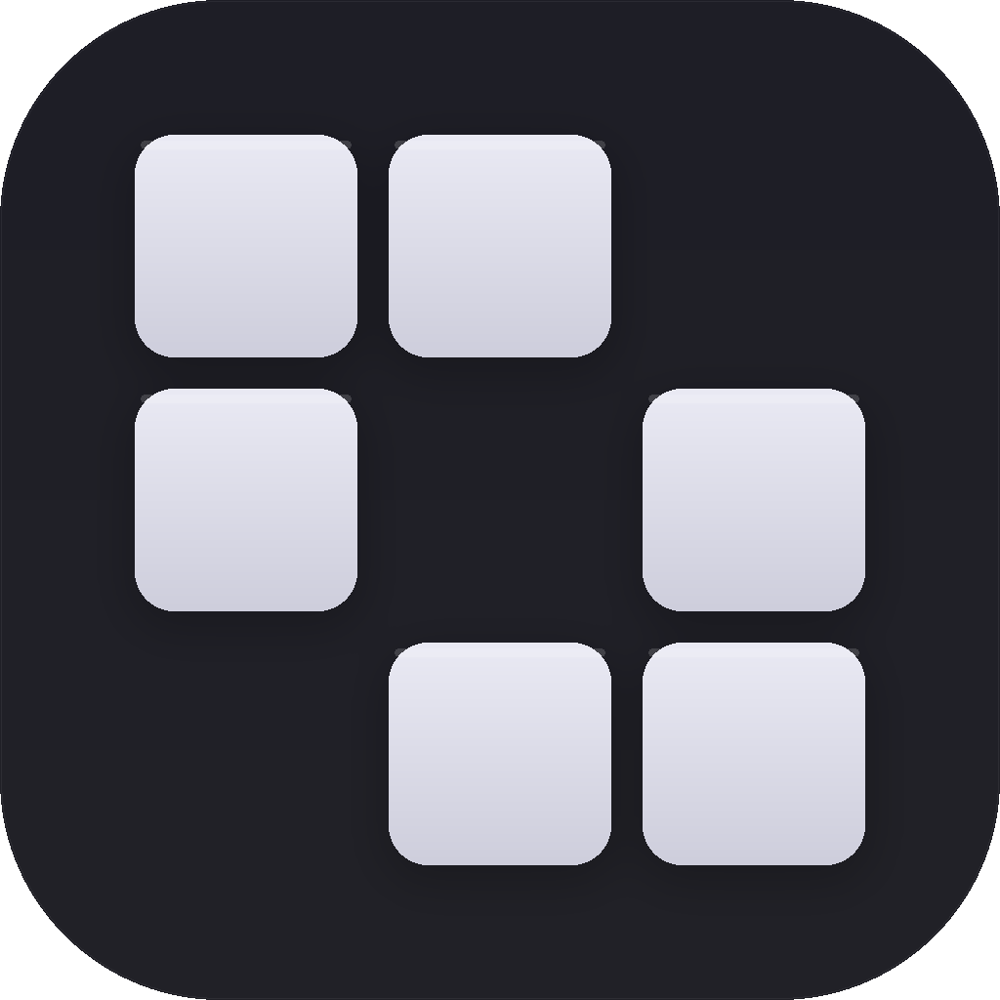

# Skills Manager

A native macOS app to manage skills across all your coding agents — Claude Code, Cursor, Copilot CLI, Codex, Gemini CLI, and more.



---

## What it does

Coding agent skills are scattered everywhere. Each agent has its own format, install path, and management story. Skills Manager brings them together in one place.

- **Discover** skills from the marketplace and community sources
- **Install** to one or multiple agents at once
- **Test** skills in the built-in LLM sandbox before committing
- **Manage** installed skills — update, remove, star favorites
- **Monitor** all your agents and their skill directories in real time

## Requirements

- macOS 14 (Sonoma) or later
- One or more coding agents installed (Claude Code, Cursor, Copilot CLI, Codex, Gemini CLI…)

## Installation

Download the latest release from the [Releases](../../releases) page and drag to Applications.

Or build from source:

```bash
git clone https://github.com/yibie/skills-manager.git
cd skills-manager
open SkillsManager.xcodeproj
```

## Supported Agents

| Agent | Status |
|-------|--------|
| Claude Code | ✅ |
| Cursor | ✅ |
| Copilot CLI | ✅ |
| OpenAI Codex CLI | ✅ |
| Gemini CLI | ✅ |

## Architecture

Pure local architecture — no backend, works offline (except sandbox LLM calls). Reads and writes agent config files directly, uses Git to sync with skill marketplaces.

Built with SwiftUI + Swift 6, SwiftData, macOS 14+.

## Roadmap

- [ ] Auto-update detection for marketplace skills
- [ ] Skill conflict detection across agents
- [ ] Export / import skill sets
- [ ] Team sync via shared marketplace fork

## Contributing

Issues and PRs welcome. See [CONTRIBUTING.md](CONTRIBUTING.md) for guidelines.

## License

MIT — see [LICENSE](LICENSE).
