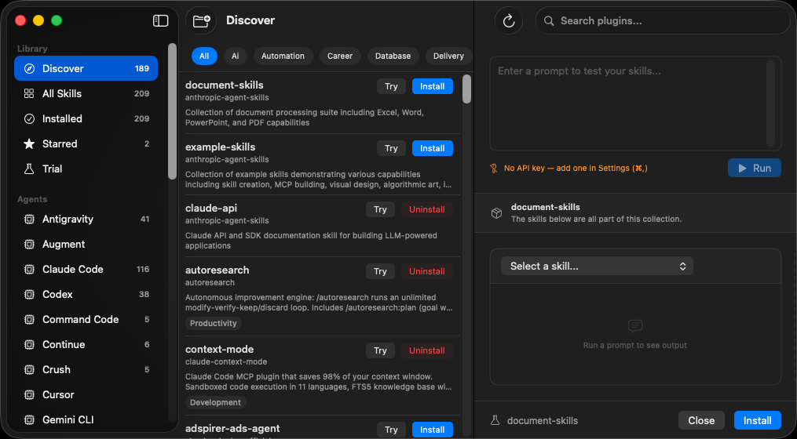
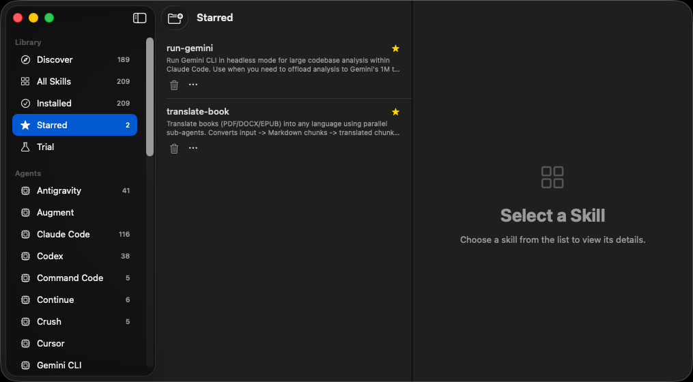

# Skills Manager

A native macOS app to manage skills across all your coding agents — Claude Code, Cursor, Copilot CLI, Codex, Gemini CLI, and more.


---

## Screenshots


*Discover skills from skills.sh and inspect them in the native detail view*


*Manage your library — filter by agent, source, or starred*

---

## What it does

Coding agent skills are scattered everywhere. Each agent has its own format, install path, and management story. Skills Manager brings them together in one place.

- **Discover** skills from [skills.sh](https://skills.sh/) and community repositories
- **Install** to one or multiple agents at once
- **Test** skills in the built-in LLM sandbox before committing
- **Manage** installed skills — update, remove, star favorites
- **Monitor** all your agents and their skill directories in real time

## Requirements

- macOS 14 (Sonoma) or later
- One or more coding agents installed (Claude Code, Cursor, Copilot CLI, Codex, Gemini CLI…)

## Installation

Download the latest release from the [Releases](../../releases) page and drag to Applications.

Or build from source:

```bash
git clone https://github.com/yibie/skills-manager.git
cd skills-manager
open SkillsManager.xcodeproj
```

## Supported Agents

| Agent | Status |
|-------|--------|
| Claude Code | ✅ |
| Cursor | ✅ |
| Copilot CLI | ✅ |
| OpenAI Codex CLI | ✅ |
| Gemini CLI | ✅ |

## Architecture

Pure local architecture — no backend, works offline except for network-backed features like Discover detail loading and sandbox LLM calls. Reads and writes agent config files directly and uses local Git history for version management.

Built with SwiftUI + Swift 6, SwiftData, macOS 14+.

## Terminal UI

The repository also includes a terminal UI in `tui/`.

Current status:
- **Blessed TUI:** complete for the current scope and treated as the primary terminal implementation
- **Ink TUI:** historical backup/reference only, no longer the target runtime

Official CLI command:

```bash
cd tui
npm exec skills-manager
```

For a global command, run once inside `tui/`:

```bash
npm link
```

Then launch from anywhere with:

```bash
skills-manager
```

The Blessed TUI currently supports:
- three-panel keyboard-first navigation
- discover via [skills.sh](https://skills.sh/)
- install / uninstall / star
- source-file opening and discover source-page opening
- search, detail overlays, full refresh
- version history is temporarily disabled
- local / plugin differentiation, including Codex plugin cache and Pi package resources

## Roadmap

- [ ] Auto-update detection for discovered skills
- [ ] Skill conflict detection across agents
- [ ] Export / import skill sets
- [ ] Team sync via shared skills repository

## Contributing

Issues and PRs welcome. See [CONTRIBUTING.md](CONTRIBUTING.md) for guidelines.

## License

MIT — see [LICENSE](LICENSE).
