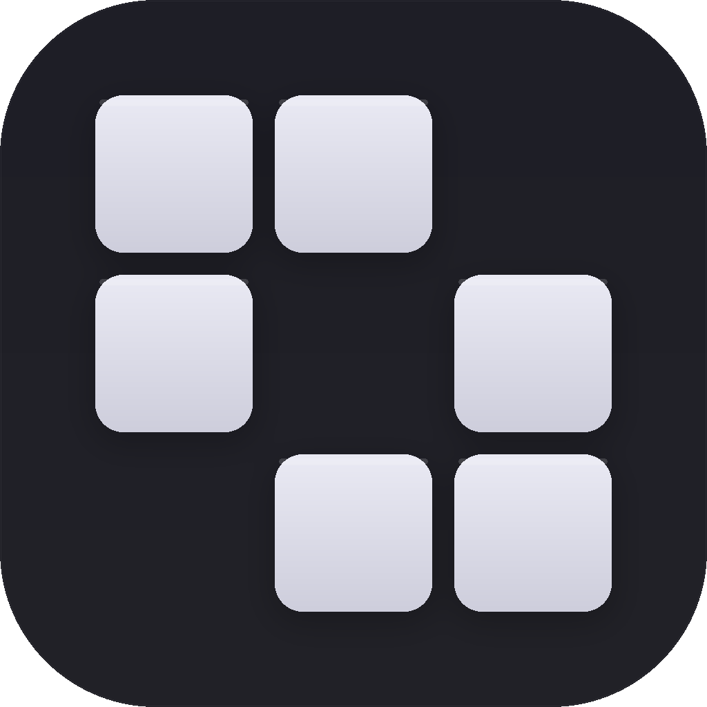
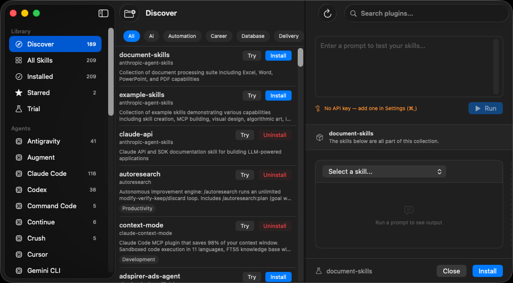
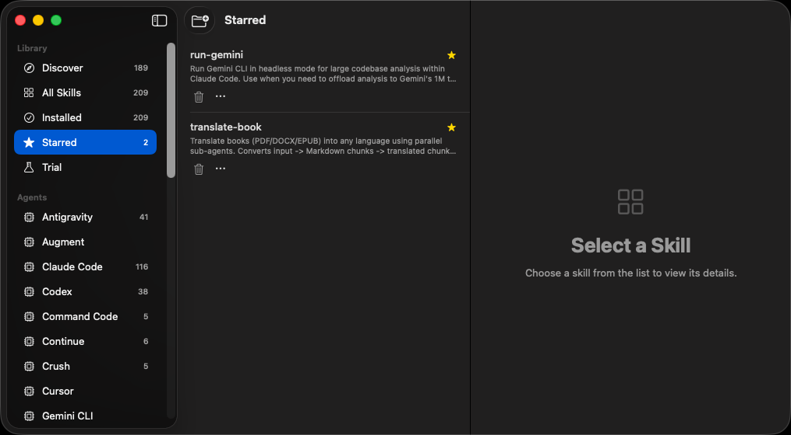

# Skills Manager

A native macOS app to manage skills across all your coding agents — Claude Code, Cursor, Codex, Gemini CLI, Qwen Code, Roo Code, Continue, OpenHands, OpenClaw, and more.



---

## Screenshots


*Discover skills from skills.sh and inspect them in the native detail view*


*Manage your library — filter by agent, source, or starred*

---

## What it does

Coding agent skills are scattered everywhere. Each agent has its own format, install path, and management story. Skills Manager brings them together in one place.

- **Discover** skills from [skills.sh](https://skills.sh/) and community repositories, including full-site search beyond the initially loaded list
- **Install** to one or multiple agents at once
- **Test** skills in the built-in LLM sandbox before committing
- **Manage** installed skills — update, remove, star favorites
- **Monitor** all your agents and their skill directories in real time
- **Translate** discovered skill summaries with bundled Chinese descriptions and on-demand LLM fallback for newly loaded entries

## Requirements

- macOS 14 (Sonoma) or later
- One or more coding agents installed (Claude Code, Cursor, Copilot CLI, Codex, Gemini CLI…)

## Installation

Download the latest release from the [Releases](../../releases) page and drag to Applications.

Or build from source:

```bash
git clone https://github.com/yibie/skills-manager.git
cd skills-manager
open SkillsManager.xcodeproj
```

## Supported Agents

Skills Manager detects and scans every agent below through `AgentRegistry`. The `Install target` column marks agents that are available in the current multi-install picker; the remaining agents are still detected and scanned from their registered skills directory when installed locally.

| Agent | Registry ID | Install target |
|-------|-------------|----------------|
| Claude Code | `claude-code` | Yes |
| Amp | `amp` | Scan |
| Cline | `cline` | Scan |
| Codex | `codex` | Yes |
| Cursor | `cursor` | Yes |
| Deep Agents | `deepagents` | Scan |
| Firebender | `firebender` | Scan |
| Gemini CLI | `gemini-cli` | Yes |
| GitHub Copilot | `github-copilot` | Yes |
| Kimi Code CLI | `kimi-cli` | Scan |
| Replit | `replit` | Scan |
| Warp | `warp` | Scan |
| Antigravity | `antigravity` | Scan |
| Augment | `augment` | Yes |
| IBM Bob | `bob` | Scan |
| CodeBuddy | `codebuddy` | Scan |
| Command Code | `command-code` | Yes |
| Continue | `continue` | Yes |
| Cortex Code | `cortex` | Scan |
| Crush | `crush` | Scan |
| Droid | `droid` | Scan |
| Goose | `goose` | Scan |
| iFlow CLI | `iflow-cli` | Yes |
| Junie | `junie` | Scan |
| Kilo Code | `kilo` | Yes |
| Kiro CLI | `kiro-cli` | Yes |
| Kode | `kode` | Scan |
| MCPJam | `mcpjam` | Yes |
| Mistral Vibe | `mistral-vibe` | Scan |
| Mux | `mux` | Yes |
| Neovate | `neovate` | Yes |
| OpenCode | `opencode` | Yes |
| OpenHands | `openhands` | Yes |
| Pi | `pi` | Yes |
| Pochi | `pochi` | Scan |
| Qoder | `qoder` | Scan |
| Qwen Code | `qwen-code` | Yes |
| Roo Code | `roo` | Yes |
| Trae | `trae` | Scan |
| Trae CN | `trae-cn` | Scan |
| Windsurf | `windsurf` | Scan |
| Zencoder | `zencoder` | Scan |
| AdaL | `adal` | Scan |
| OpenClaw | `openclaw` | Scan |

## Discover and Translation

Discover starts fast from a local cache at `~/.skills-manager/cache/discover-directory.json`, then refreshes from skills.sh in the background. Search uses the skills.sh full-site API when online and falls back to cached query snapshots when offline.

The app bundles a generated description translation catalog for Chinese summaries and still keeps an on-demand translation button as a temporary fallback for newly loaded or uncached descriptions. Local Ollama and LM Studio endpoints are normalized to IPv4 loopback (`127.0.0.1`) at runtime to avoid macOS `localhost` resolving to IPv6 `::1`.

## Architecture

Pure local architecture — no backend, works offline except for network-backed features like Discover refresh/search, detail loading, translation fallback, and sandbox LLM calls. Reads and writes agent config files directly and uses local Git history for version management.

Built with SwiftUI + Swift 6, SwiftData, macOS 14+.

## Terminal UI

The repository also includes a terminal UI in `tui/`.

Current status:
- **Blessed TUI:** complete for the current scope and treated as the primary terminal implementation
- **Ink TUI:** historical backup/reference only, no longer the target runtime

Official CLI command:

```bash
cd tui
npm exec skills-manager
```

For a global command, run once inside `tui/`:

```bash
npm link
```

Then launch from anywhere with:

```bash
skills-manager
```

The Blessed TUI currently supports:
- three-panel keyboard-first navigation
- discover via [skills.sh](https://skills.sh/)
- install / uninstall / star
- source-file opening and discover source-page opening
- search, detail overlays, full refresh
- version history is temporarily disabled
- local / plugin differentiation, including Codex plugin cache and Pi package resources

## Roadmap

- [ ] Auto-update detection for discovered skills
- [ ] Skill conflict detection across agents
- [ ] Export / import skill sets
- [ ] Team sync via shared skills repository

## Contributing

Issues and PRs welcome. See [CONTRIBUTING.md](CONTRIBUTING.md) for guidelines.

## License

MIT — see [LICENSE](LICENSE).
