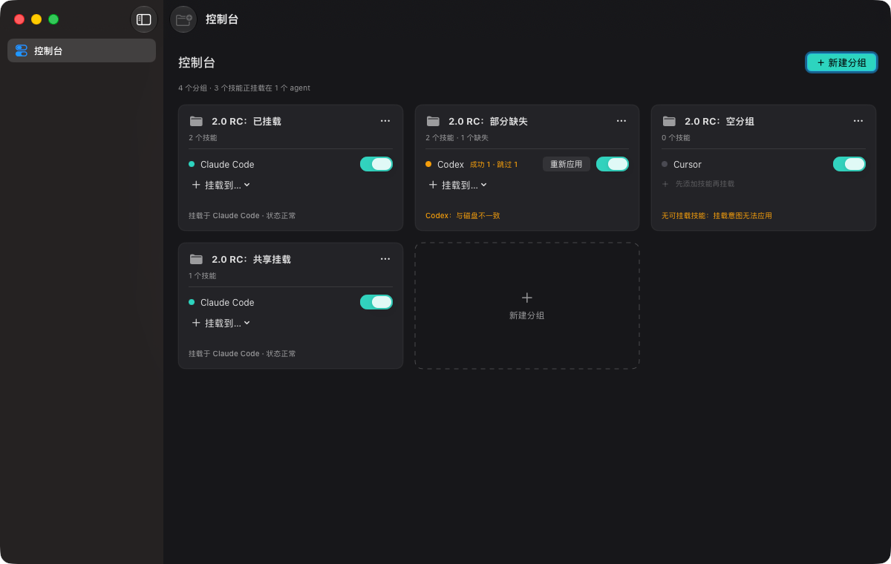
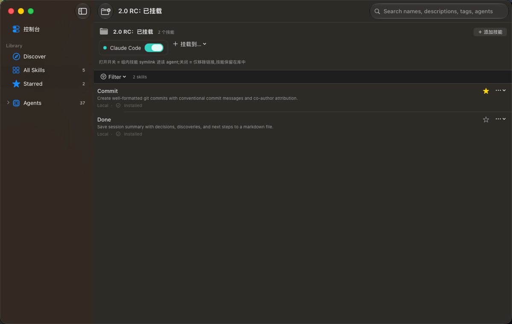

# Skills Manager

A native macOS app to manage skills across all your coding agents — Claude Code, Cursor, Codex, Gemini CLI, Qwen Code, Roo Code, Continue, OpenHands, OpenClaw, and more.

**Current source version: 2.0.0 (build 200).**


---

## Screenshots


*Organize Library skills into Collections, then mount them into agents without moving or duplicating the originals*


*Inspect Collection membership and mounted agents while keeping missing or diverged state visible*

---

## What's new in 2.0.0

Version 2.0 turns Skills Manager from a directory browser into a local skill lifecycle control plane built around `Library → Collection → Mount`.

```text
Library      trusted, managed skill sources
   ↓
Collection   reusable groups for a project or workflow
   ↓
Mount        links a Collection into one or more agents on demand
```

### From 1.x to 2.0

| Area | 1.x | 2.0 |
|------|-----|-----|
| Product model | Browse and manage agent skill directories | Manage the complete local skill lifecycle |
| Organization | Skills live primarily inside each agent directory | A managed Library supplies reusable Collections |
| Multi-agent use | Install and maintain skills for each agent separately | Mount or unmount a Collection without moving or duplicating its Library skills |
| State | Primarily installed or not installed | Missing, shared, partially applied, and diverged states remain visible and can be reapplied explicitly |
| Identity | Names and paths do most of the matching | Durable skill IDs connect upgrades, Collections, stars, the macOS app, and the TUI |
| Ownership and recovery | Basic provider install and removal flows | Provider ownership is preserved; takeover keeps recoverable backups and refuses ambiguous destructive repairs |
| Navigation | Directory-oriented agent views | Agent home pages, conflict diagnosis, full-site Discover search, Copy ID, Copy Path, and Show in Finder |
| Agent support | Core agent scanning and installation | A broader registry, including first-class XDG-aware OpenCode support and correctly classified neutral shared roots |
| Localization | UI strings did not have a consistent English fallback | English is the source and fallback language; macOS can select the bundled Simplified Chinese localization |

The architecture remains local-first: there is no Skills Manager backend, unmounting never deletes the Library copy, and network access is limited to features such as Discover, translation fallback, and LLM Try calls.

## What it does

Coding agent skills are scattered everywhere. Each agent has its own format, install path, and management story. Skills Manager brings them together in one place.

- **Discover** skills from [skills.sh](https://skills.sh/) and community repositories, including full-site search beyond the initially loaded list
- **Install** to one or multiple agents at once
- **Try** skills with your own LLM (Claude, OpenAI, OpenRouter, Ollama, or LM Studio) before installing
- **Manage** installed skills regardless of where they came from — update or remove through the detected provider, star favorites (stars are shared with the terminal UI), and spot diverged same-name copies across agents (Conflicts)
- **Group skills into collections** and mount a collection into an agent only when needed — symlinks in, links out, the library stays put (sidebar → Control Center)
- **Monitor** agent skill directories and refresh automatically when they change on disk
- **Agent home pages** — clicking an agent in the sidebar opens its home: detection status and skills directory (Show in Finder / Copy Path), conflicts involving that agent, and its full skill list
- **Translate** discovered skill summaries with a bundled 8-language catalog and on-demand LLM fallback for newly loaded entries

## Requirements

- macOS 14 (Sonoma) or later
- One or more coding agents installed (Claude Code, Cursor, Copilot CLI, Codex, Gemini CLI…)

## Installation

Download [Skills Manager 2.0.0](../../releases/download/v2.0.0/SkillsManager-v2.0.0.zip) and drag it to Applications. The universal app is Developer ID signed, Apple-notarized, and accepted by Gatekeeper. SHA-256: `8da1f38838119864e593e9e591355dd53b5d407e4a7383aac68f095efdac1ad5`.

Upgrading from 1.x? Read the [2.0.0 upgrade and rollback guide](docs/releases/2.0.0.md) first. All releases remain available on the [Releases](../../releases) page.

Or build from source:

```bash
git clone https://github.com/yibie/skills-manager.git
cd skills-manager
open SkillsManager.xcodeproj
```

## Supported Agents

Skills Manager detects and scans every agent below through `AgentRegistry`. The `Install target` column marks agents that are available in the current multi-install picker; the remaining agents are still detected and scanned from their registered skills directory when installed locally.

| Agent | Registry ID | Install target |
|-------|-------------|----------------|
| Claude Code | `claude-code` | Yes |
| Amp | `amp` | Scan |
| Cline | `cline` | Scan |
| Codex | `codex` | Yes |
| Cursor | `cursor` | Yes |
| Deep Agents | `deepagents` | Scan |
| Firebender | `firebender` | Scan |
| Gemini CLI | `gemini-cli` | Yes |
| GitHub Copilot | `github-copilot` | Yes |
| Kimi Code CLI | `kimi-cli` | Scan |
| Replit | `replit` | Scan |
| Warp | `warp` | Scan |
| Antigravity | `antigravity` | Scan |
| Augment | `augment` | Yes |
| IBM Bob | `bob` | Scan |
| CodeBuddy | `codebuddy` | Scan |
| Command Code | `command-code` | Yes |
| Continue | `continue` | Yes |
| Cortex Code | `cortex` | Scan |
| Crush | `crush` | Scan |
| Droid | `droid` | Scan |
| Goose | `goose` | Scan |
| iFlow CLI | `iflow-cli` | Yes |
| Junie | `junie` | Scan |
| Kilo Code | `kilo` | Yes |
| Kiro CLI | `kiro-cli` | Yes |
| Kode | `kode` | Scan |
| MCPJam | `mcpjam` | Yes |
| Mistral Vibe | `mistral-vibe` | Scan |
| Mux | `mux` | Yes |
| Neovate | `neovate` | Yes |
| OpenCode | `opencode` | Yes |
| OpenHands | `openhands` | Yes |
| Pi | `pi` | Yes |
| Pochi | `pochi` | Scan |
| Qoder | `qoder` | Scan |
| Qwen Code | `qwen-code` | Yes |
| Roo Code | `roo` | Yes |
| Trae | `trae` | Scan |
| Trae CN | `trae-cn` | Scan |
| Windsurf | `windsurf` | Scan |
| Zencoder | `zencoder` | Scan |
| AdaL | `adal` | Scan |
| OpenClaw | `openclaw` | Scan |

OpenCode uses `$XDG_CONFIG_HOME/opencode/skills` (or `~/.config/opencode/skills` when `XDG_CONFIG_HOME` is unset). **Import Folder** expects the agent's exact skills directory and uses it for both scanning and future installs.

`$XDG_CONFIG_HOME/agents/skills` and `~/.agents/skills` are neutral shared roots. OpenClaw-specific discovery is limited to its `clawd`, npm-global, and workspace-main roots so shared skills are not mislabeled as OpenClaw.

## Discover and Translation

Discover starts fast from a local cache at `~/.skills-manager/cache/discover-directory.json`, then refreshes from skills.sh in the background. Search uses the skills.sh full-site API when online and falls back to cached query snapshots when offline.

The app bundles a generated description translation catalog covering 8 languages (English, Simplified/Traditional Chinese, Japanese, Korean, French, German, Spanish) and still keeps an on-demand translation button as a temporary fallback for newly loaded or uncached descriptions. Local Ollama and LM Studio endpoints are normalized to IPv4 loopback (`127.0.0.1`) at runtime to avoid macOS `localhost` resolving to IPv6 `::1`.

## Architecture

Pure local architecture — no backend, works offline except for network-backed features like Discover refresh/search, detail loading, translation fallback, and LLM Try calls. Reads and writes agent config files directly. The terminal UI additionally keeps a local Git history of skill installs for version management (diff and rollback).

The macOS app owns the lifecycle:

- `skills.sh` supplies discovery data only. Installing from Discover downloads the GitHub skill package directly, preserves its scripts/assets, writes it to the managed Library, and creates agent links without requiring Node or `npx`.
- Skills installed by the Vercel Skills CLI are recognized from its global v3 lock file and managed through that provider when `npx` is available.
- If that provider is unavailable, an update can move the existing provider copy to Trash and adopt the refreshed package into the managed Library; native removal also clears stale provider metadata.
- Unmount removes agent links but keeps the Library copy. Delete from Library is a separate confirmed operation. External OpenClaw/plugin content is moved to macOS Trash rather than permanently deleted.

Built with SwiftUI + Swift 6, SwiftData, macOS 14+.

## Terminal UI

The repository also includes a terminal UI in `tui/`.

Current status:
- **Blessed TUI:** complete for the current scope and treated as the primary terminal implementation
- **Ink TUI:** historical backup/reference only, no longer the target runtime

Official CLI command:

```bash
cd tui
npm exec skills-manager
```

For a global command, run once inside `tui/`:

```bash
npm link
```

Then launch from anywhere with:

```bash
skills-manager
```

The Blessed TUI currently supports:
- three-panel keyboard-first navigation
- discover via [skills.sh](https://skills.sh/)
- install / uninstall / star (direct install currently targets Claude Code; Discover installs can target multiple agents; stars sync with the macOS app via `~/.skills-manager/tui-state.json`)
- source-file opening and discover source-page opening
- search, detail overlays, full refresh
- version history with diff and rollback (press `H`)
- local / plugin differentiation, including Codex plugin cache and Pi package resources

## Roadmap

- [ ] Auto-update detection for discovered skills
- [x] Skill conflict detection across agents
- [ ] Export / import skill sets
- [ ] Team sync via shared skills repository

## Contributing

Issues and PRs welcome. See [CONTRIBUTING.md](CONTRIBUTING.md) for guidelines.

## License

MIT — see [LICENSE](LICENSE).
